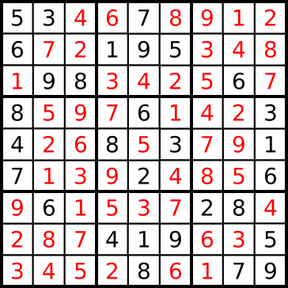
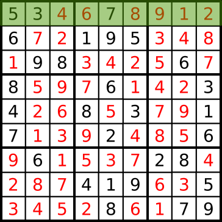
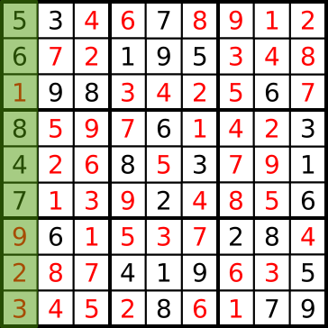
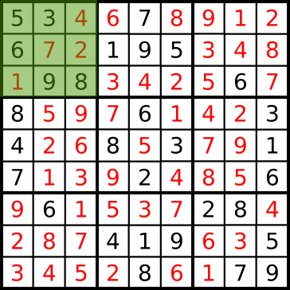

!SLIDE 
# Hack night #
## Nov 2012 ##

!SLIDE
# Sudoku Solver #

!SLIDE
# Sudoku #
Sudoku is a logic-based, combinatorial number-placement puzzle. The objective
is to fill a 9×9 grid with digits so that each column, each row, and each of
the nine 3×3 sub-grids that compose the grid contains all of the digits from 1
to 9. The puzzle setter provides a partially completed grid, which typically
has a unique solution.

!SLIDE center

!SLIDE center

!SLIDE center

!SLIDE center

!SLIDE center

!SLIDE center
# Input format #

!SLIDE center
# Input format #
    530 070 000
    600 195 000
    098 000 060
    
    800 060 003
    400 803 001
    700 020 006
    
    060 000 280
    000 419 005
    000 080 079

!SLIDE center
# Input format #
    530070000
    600195000
    098000060
    
    800060003
    400803001
    700020006
    
    060000280
    000419005
    000080079

!SLIDE center
# Input format #
    530070000
    600195000
    098000060
    800060003
    400803001
    700020006
    060000280
    000419005
    000080079

!SLIDE center
# Input format #
    530070000600195000098000060800...etc

9x9 = 81 characters

!SLIDE center
# Puzzles #
[http://wholemeal.co.nz/~malc/sudoku/](http://wholemeal.co.nz/~malc/sudoku/)

3 files (easy, medium and hard), 30 puzzles per file, 1 puzzle per line

Courtesy of [https://github.com/romario333/opensudoku](https://github.com/romario333/opensudoku)
